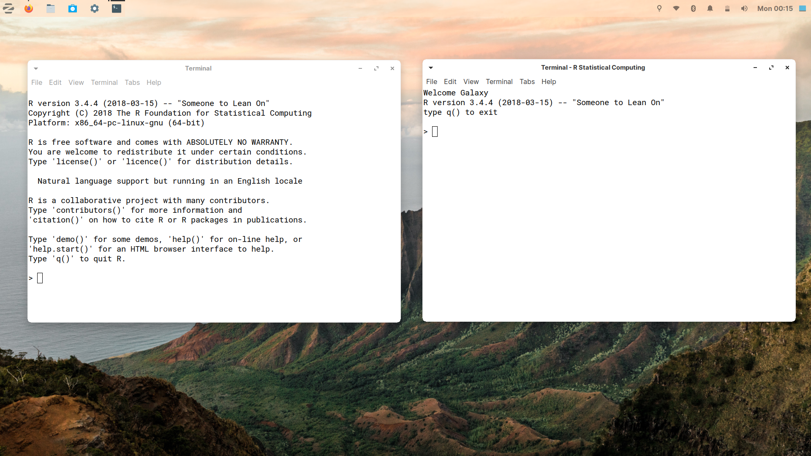

R default desktop launcher looks bad.\
The default launcher simply executes a command "**R**"

**To change that**

First run a **chmod +x** on the script file in this repo. eg. `chmod +x Rdesktop.sh` 

Now open default R.desktop file. \
Replace the default command 'R' with the absolute path of this script in EXEC section of the desktop file or\
simply in the command section in a GUI based desktop file edior.

**If you don't have access to R.desktop**, \
it's usually present in `/usr/share/applications` at least when you have \
installed R properly on your system and haven't messed up. \
Anyways you can have a look on this link on template of .desktop files\
https://developer.gnome.org/integration-guide/stable/desktop-files.html.en \
and create one yourself.

## Before and After

